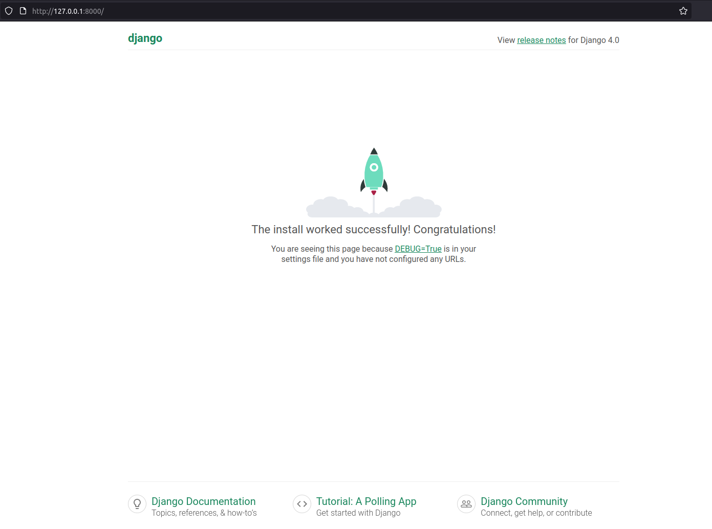

# How to create a custom authentication backend in Django

## Introduction

Django comes with
[built-in authentication backends](https://docs.djangoproject.com/en/4.0/topics/auth/)
that make it really easy to get started and meet most projects' needs. There are
also a slew of Django apps (such as [django-allauth](https://django-allauth.readthedocs.io/))
that have been written to integrate your Django application with identity
providers such as Google and GitHub. But when even these don't meet your
project's requirements, there is the option of creating your own custom
authentication backend. This sounds like a complicated thing to do, but is
actually really simple.

This tutorial will take you from absolute zero to a fully working authentication
system in Django. We'll also make it reusable so you can take it and plug it
into any other projects that you may have.

Note that will not be covered in this tutorial (but I will cover later) are:

+ Custom authorization schemes in Django
+ Building a custom REST API authentication backend in Django

## Starting the application

### Poetry

Let's start by creating a [Poetry](https://python-poetry.org/) (you could simply
use `pip` if you prefer) configuration file for the project. If not installed,
please [install Poetry](https://python-poetry.org/docs/#installation).

```sh
poetry init
```

Fill in your details, and choose to not define your dependencies interactively.
Once complete, open the `pyproject.toml` file and ensure that it has content
similar to:

```toml
[tool.poetry]
name = "your-application-name-here"
version = "0.1.0"
description = ""
authors = ["Your Name <your-email@example.com>"]

[tool.poetry.dependencies]
python = "^3.10"
Django = "^4.0.5"

[tool.poetry.dev-dependencies]

[build-system]
requires = ["poetry-core>=1.0.0"]
build-backend = "poetry.core.masonry.api"
```

Then open up a Poetry virtual environment and install the dependencies in it:

```sh
poetry shell
poetry install
poetry update
```

Check the installation of Django:

```sh
python -m django --version
# 4.0.5
```

### Starting the Django Project and App

If you don't already know, Django has the concept of "projects" and pluggable
"apps" that you install into the project. Let's start the project by running:

```sh
django-admin startproject mysite .
```

Note the trailing dot in the above command.

Now we can go ahead and create the django app. We'll make this application
reusable, so go ahead and give it a name that suits your needs. For example, if
your ultimate goal is to authenticate with `Dex` or `Keycloak` call it something
like `dex_authentication` or `keycloak_authentication`. As a way of example, I
am just going to do an in-memory authentication, so I will run:

```sh
python manage.py startapp in_memory_authentication
```

At this stage, we should actually be able to start the Django application. Run:

```sh
python manage.py runserver
```

Navigate to the URL shown (usually `http://localhost:8000`) and you should see
a lovely rocket blasting off:


